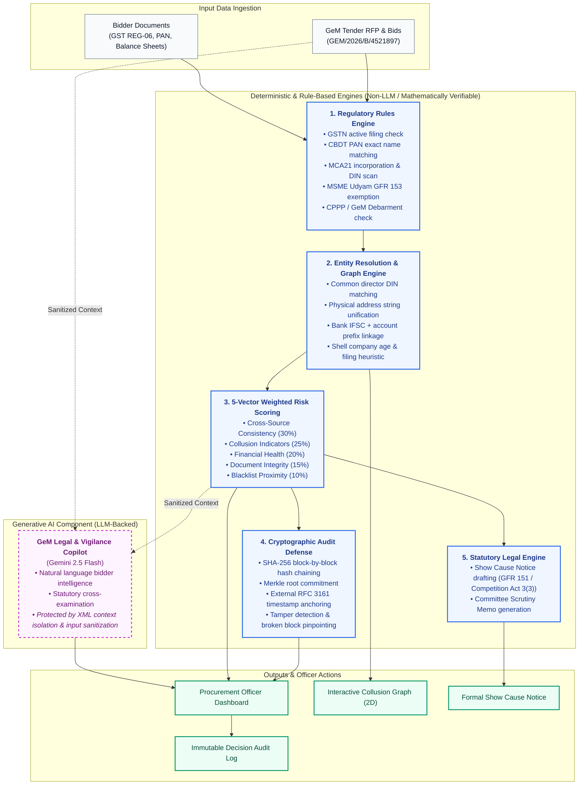

# 🛡️ AuthBid — GeM Compliance Intelligence
## AI-Powered Integrated Bid Compliance Verification & Collusion Detection Platform
**Project ID:** SIH26100 | Smart India Hackathon  
**Target Domain:** Public Procurement & Bid Scrutiny on Government e-Marketplace (GeM)

---

## 📌 Executive Summary

**AuthBid** is an end-to-end intelligent compliance verification system designed for procurement officers scrutinizing tenders on the Government e-Marketplace (GeM). It replaces time-consuming, error-prone manual document verification with an automated multi-agent AI pipeline, detects organized bid-rigging and cartel formation via graph neural entity resolution, and maintains an immutable, cryptographically verifiable SHA-256 hash-chained audit trail.

---

## 🏗️ System Architecture & Workflow

---

## 🚀 Core Functionalities

### 1. 🤖 Automated Multi-Agent Verification Pipeline
Instead of procurement committees spending days manually examining certificates, a 5-stage sequential agent pipeline automates evaluation:
* **Agent 1: RFP & Eligibility Ingestion**
  * Parses tender criteria, including technical specifications, minimum annual turnover, minimum years of operational experience, and domestic local content (Make-in-India) thresholds.
* **Agent 2: Simulated Multi-Registry Verification**
  * **GSTN (GST Portal)**: Validates active registration, jurisdiction, tax slab, and regularity of monthly GSTR-3B filings.
  * **PAN (NSDL/UTIITSL)**: Verifies valid PAN status and performs fuzzy name matching (85% similarity threshold via `difflib.SequenceMatcher`) against the registered corporate entity name, catching typos without false-flagging.
  * **MCA21 (Ministry of Corporate Affairs)**: Validates Corporate Identification Number (CIN), active Director Identification Numbers (DINs), paid-up capital, date of incorporation, and registered office.
  * **Udyam / MSME Portal**: Validates Micro/Small/Medium Enterprise registration to determine statutory relaxations (e.g., turnover and prior experience exemptions under GFR Rule 153).
  * **Debarment & Blacklist Registry**: Scans against Central Public Procurement Portal (CPPP) and GeM incident management blacklists.
* **Agent 3: Cross-Source Consistency & Triangulation**
  * Cross-verifies declared financial turnovers against actual GST taxable filings (sum of last 12 months' GSTR-3B `taxable_value`) and Income Tax Returns (ITR) to catch fabricated turnover certificates. Flags discrepancies where declared turnover exceeds GST-implied revenue by >50%.
* **Agent 4: Composite Risk Scoring Engine**
  * Generates an explainable 0–100 risk score based on five weighted components:
    1. **Cross-Source Consistency (30%)**
    2. **Collusion Indicators (25%)**
    3. **Financial Health & Turnover (20%)**
    4. **Document Integrity & Checksums (15%)**
    5. **Blacklist Proximity & History (10%)**
* **Agent 5: Cryptographic SHA-256 Audit Anchoring**
  * Hashes all input data, rule outputs, and verification determinations, chaining them cryptographically and anchoring to an external RFC 3161 timestamp log to prevent ex-post alterations.

---

### 2. 🕸️ Interactive Collusion & Knowledge Graph (Dashboard Graph Tab)
Cartels and shell companies frequently submit artificial "cover bids" to simulate competition. AuthBid uncovers these syndicates using an interactive 2D Force-Directed Graph:
* **Entity Resolution**:
  * **Shared Directors / DINs**: Connects distinct bidder companies that share board members or authorized signatories.
  * **Shared Registered Addresses**: Maps multiple bidding companies operating out of the same physical building, suite, or pincode.
  * **Shared Banking Footprint**: Flags bidders using the same IFSC branch, account number prefixes, or common bank accounts.
  * **Shared Contact Details**: Links corporate profiles sharing identical phone numbers or administrative emails.
* **Shell Company Heuristics**:
  * Automatically flags entities incorporated shortly before tender issuance (e.g., < 3 months) with no verifiable GST filing history.
* **Graph Filters & Focus**:
  * Toggle between the complete ecosystem or **Suspicious Only** edges.
  * Filter by specific detected collusion rings.

---

### 3. 📊 Commercial Price & Spectrum Analysis
* **L1 Anomaly & Outlier Detection**: Identifies abnormally low tenders (bids heavily undercut to win awards but likely to result in contract abandonment or sub-par quality).
* **Price Clustering Detection**: Visualizes bid quotes across a distribution curve to identify unnaturally tight pricing spreads characteristic of collusive price fixing.
* **Budget Benchmark Comparison**: Evaluates quotes against government estimated tender sanction values (e.g., ₹2.50 Cr).

---

### 4. 🔒 Tamper-Evident Cryptographic Audit Trail (Dashboard Audit Tab)
* **SHA-256 Hash-Chained Blockchain-Style Ledger**:
  * Every pipeline action logs:
    $$\text{current\_hash} = \text{SHA-256}(\text{prev\_hash} \parallel \text{agent\_id} \parallel \text{action} \parallel \text{input\_hash} \parallel \text{output\_hash})$$
* **Live Chain Validation**:
  * Real-time traversal checks verifying that every block correctly points to the preceding block's hash.
* **Interactive Tamper Simulation (`Simulate Tampering`)**:
  * Allows evaluators and committee members to simulate an unauthorized database record modification, demonstrating immediate chain rupture detection with exact block identification.
* **Cryptographic Restore**:
  * Demonstrates the re-anchoring of cryptographic proofs back to a verified state.

---

### 5. 📑 Document Vault & Dossier Inspection
* Detailed digital dossier for each bidder holding extracted artifacts:
  * GST Registration Certificate (Form REG-06)
  * Corporate PAN Card
  * Audited Balance Sheets & Profit & Loss statements
  * Income Tax Return (ITR-V) Acknowledgments
  * Udyam MSME Registration Certificate
  * Make-in-India Local Value Addition Self-Declaration
* Features SHA-256 file checksums, verified badges, and cross-source verification evidence.

---

### 6. ⚖️ Automated Legal Show Cause Notice Generation
* Instantly drafts formal, legally backed **Show Cause Notices** against non-compliant or colluding bidders.
* Cites statutory legal frameworks:
  * **Section 3(3) of the Competition Act, 2002**: Prohibition of anti-competitive agreements, bid-rigging, and collusive bidding.
  * **Rule 151 of General Financial Rules (GFR) 2017**: Debarment from bidding for integrity offenses and falsification.
  * **GeM Incident Management Policy**: Standard operating procedures for vendor blacklisting.
* Features integrated export and print formatting for official dispatch.

---

### 7. 💬 AI Procurement Copilot
* Conversational AI sidecar powered by Gemini 2.5 Flash via `langchain-google-genai` (with reliable rule-based deterministic fallback when `GEMINI_API_KEY` is not set).
* Allows procurement officers to query bid data in plain English:
  * *"Why was Bidder B001 marked as critical risk?"*
  * *"Show all bidders exempted under the MSE category."*
  * *"What is the evidence linking B001, B003, and B007?"*

---

### 8. 📝 Scrutiny Report & Decision Workflow
* Enables officers to record remarks and assign formal statuses:
  * 🟢 **Eligible**
  * 🟡 **Under Review / Clarification Sought**
  * 🔴 **Disqualified**
* Generates a comprehensive **Executive Scrutiny Report** suitable for tender evaluation committees, summarizing technical compliance, commercial pricing, and disqualification grounds.

---

## 🎯 Sample Demonstration Scenario

**Tender Reference:** `GEM/2026/B/4521897`  
**Description:** Supply of 500 Desktop Computers with 3-Year On-Site Warranty  
**Estimated Value:** ₹2,50,00,000 (₹2.50 Crore / 25,000,000 INR)  
**Dataset:** 12 Synthetic Bidders (canonical data defined in `backend/mock_apis/synthetic_data.py`) with pre-planted realistic anomalies:

| Bidder ID | Entity Name | Bid Amount | Placed Finding / Anomaly | Risk Level |
| :--- | :--- | :---: | :--- | :---: |
| **B001** | TechVision Solutions Pvt. Ltd. | ₹2,35,00,000 | **Collusion Ring 1**: Shared directors (DIN: 09876543, 08765432) & address with B003 & B007 | 🔴 Critical |
| **B002** | Reliable Computing Systems Ltd. | ₹2,42,00,000 | Clean bidder; valid MSME, GST, and MCA records; compliant BIS & ISO 9001:2015 | 🟢 Low |
| **B003** | DigiCore Infosystems Pvt. Ltd. | ₹2,48,00,000 | **Collusion Ring 1**: Shared directors with B001 & B007 | 🔴 Critical |
| **B004** | GreenTech Peripherals | ₹2,28,00,000 | Expired MSME registration (expired 2025-12-31); under observation for MSE relaxation | 🟢 Low |
| **B005** | NexGen IT Solutions Pvt. Ltd. | ₹2,39,00,000 | **Collusion Ring 2**: Shared bank branch (PNB, IFSC: PUNB0123400) & director phone with B009 | 🔴 High |
| **B006** | Bharat Electronics & Computing | ₹2,45,00,000 | PAN registered name typo (97% fuzzy match — passes 85% threshold) | 🟢 Low |
| **B007** | Quantum Digital Services Pvt. Ltd. | ₹2,20,00,000 | **Collusion Ring 1**: Shell company (<90 days old, zero GST history) submitting cover bid | 🔴 Critical |
| **B008** | MegaByte Computers Pvt. Ltd. | ₹2,40,00,000 | Historical debarment record on MoD/GeM incident database (status cleared; under observation) | 🟢 Low |
| **B009** | CloudFirst Technologies Pvt. Ltd. | ₹2,32,00,000 | **Collusion Ring 2**: Shared bank branch (PNB, IFSC: PUNB0123400) & contact phone with B005 | 🔴 High |
| **B010** | Pinnacle Systems India Pvt. Ltd. | ₹2,48,00,000 | Clean bidder; fully compliant ISO 9001:2015, ISO 27001, BIS certified | 🟢 Low |
| **B011** | ByteWave Electronics Pvt. Ltd. | ₹2,30,00,000 | Non-compliance in GST (2 unfiled GSTR-3B return periods; under observation) | 🟢 Low |
| **B012** | Atlas Infosys Solutions Pvt. Ltd. | ₹2,46,00,000 | Clean bidder; fully verified domestic manufacturer (MII 68%) | 🟢 Low |

---

## 💻 Tech Stack

| Layer | Technologies Used | Notes |
| :--- | :--- | :--- |
| **Frontend** | Next.js 16 (App Router, Turbopack), React 19, TypeScript, TailwindCSS v4, Lucide-React, Recharts, React-Force-Graph-2D | Dashboard tabs (`dashboard`, `bidders`, `graph`, `checklist`, `audit`, `report`) within single-page app (`app/page.tsx`). No Next Auth, Zod, or Server Actions used. |
| **Authentication & RBAC** | Header-based (`X-User-Role: officer \| committee_member \| admin`) | Lightweight header-based simulation for local demo & instant officer role-switching; production OAuth2/SSO integration documented in roadmap. |
| **Backend** | FastAPI (Python 3.12), Pydantic v2, Uvicorn, Python-Multipart | RESTful API endpoints under `/api/` |
| **Database & Cache** | PostgreSQL (AsyncPG/SQLAlchemy), Neo4j Graph DB, Redis | In-memory fallback stores with canonical synthetic data for zero-dependency standalone hackathon demo |
| **AI / NLP** | Google Gemini API (`gemini-2.5-flash`), LangChain (`langchain-google-genai`) | Live LLM queries when `GEMINI_API_KEY` is configured; automatic fallback to deterministic vigilance logic |
| **Security & Integrity** | SHA-256 Hash Chaining, RFC 3161 Merkle Anchoring, CORS, Python-Jose | Immutable audit trail with live tamper simulation and verification |
| **Deployment** | Docker & Docker Compose | Multi-container setup (`docker-compose.yml`, `docker-compose.prod.yml`) |

