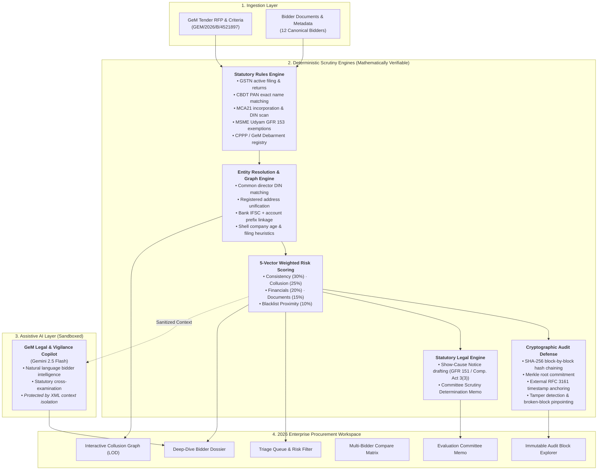

# 🛡️ AuthBid — GeM Compliance & Collusion Intelligence

[](https://fastapi.tiangolo.com/)
[](https://python.org/)
[](https://nextjs.org/)
[](https://react.dev/)
[](https://www.typescriptlang.org/)
[](https://tailwindcss.com/)
[](./LICENSE)
[](https://gem.gov.in/)

> **AI-Assisted Multi-Source Verification, Cartel & Shell Company Detection, and Cryptographic Audit Defense for Public Procurement on the Government e-Marketplace (GeM).**  
> *Smart India Hackathon (SIH26100) — Ministry of Electronics and Information Technology (MeitY) Domain.*

---

## 📖 Complete Technical Documentation

For the full architectural specification, mathematical risk formulas, entity-resolution algorithms, complete API catalogs, and regulatory roadmaps, read:
👉 **[AuthBid_Project_Documentation.md](./AuthBid_Project_Documentation.md)** (Complete 700+ line technical reference).

---

## ⚡ Quick Start

### 1. Local Run (Recommended for Evaluation)

#### Start the FastAPI Backend
```bash
cd backend
python -m uvicorn main:app --host 127.0.0.1 --port 8000 --reload
```
* API Root: `http://localhost:8000`
* Interactive OpenAPI (Swagger) Docs: `http://localhost:8000/docs`

#### Start the Next.js Frontend
```bash
cd frontend
npm install
npm run dev
```
* Web Application: `http://localhost:3000`

---

### 2. Run via Docker Compose

```bash
# Start full development stack (FastAPI + Next.js + DBs)
docker compose up -d

# Or run production stack
docker compose -f docker-compose.prod.yml up -d
```

---

## 🏗️ System Architecture

AuthBid enforces a strict architectural boundary: **all decision-critical scrutiny (eligibility checks, collusion detection, risk scoring, audit hashing) is 100% deterministic and rule-based**. Generative AI (Google Gemini 2.5 Flash) serves strictly as an assistive copilot, shielded by prompt-injection sanitization.



---

## 🌟 Core Capabilities & Workflows

| Capability | Description |
| :--- | :--- |
| **8-Stage Verification Pipeline** | Automated progression across intake, statutory registries (GSTN, PAN, MCA21, Udyam, CPPP), financial checks, cross-bidder anomaly detection, graph clustering, risk scoring, and SHA-256 ledger recording. |
| **Priority Triage Queue** | Priority-ordered review queue grouping bidders by risk severity (Critical, High, Medium, Low) with instant text search and adjudication status filters. |
| **Investigation Dossier** | Comprehensive statutory profile with identity metrics, risk score breakdown, detected anomalies with raw evidence, MCA directorships, bank details, and financial indicators. |
| **Collusion & Cartel Graph** | Interactive network canvas with Level-of-Detail (LOD) rendering: overview shows clean bidder nodes and rings; zoom/hover reveals secondary evidence nodes (directors, addresses, banks). Includes suspicious-links toggle and accessible table fallback. |
| **Multi-Bidder Comparison** | Side-by-side comparison matrix supporting up to 4 bidders with dynamic selector, bid pricing, failed checks, anomaly counts, collusion links, and officer determinations. |
| **GFR 151 Adjudication** | Formal officer decision dialog enforcing mandatory statutory grounds and justifications, automatically anchored to the cryptographic audit ledger. |
| **Show-Cause Notice Drafting** | Instant generation of formal legal notices citing Section 3(3) of the Competition Act 2002 and GFR Rule 151 with official notice numbers and response deadlines. |
| **SHA-256 Audit Trail** | Blockchain-style immutable block ledger with live "Simulate Tampering" and "Restore Chain" demonstrations, plus external RFC 3161 Merkle anchor receipts. |
| **Evaluation Committee Report** | Print-ready official determination memo summarizing technical compliance, commercial quotes, disqualified entities, and committee signature blocks. |

---

## 🎯 Canonical Demonstration Scenario

* **Tender Reference:** `GEM/2026/B/4521897` (*"Supply of 500 Desktop Computers with 3-Year On-Site Warranty"*)
* **Estimated Sanction Value:** ₹2,50,00,000 (₹2.50 Crore / 25,000,000 INR)
* **Procuring Entity:** Ministry of Electronics and Information Technology (MeitY)
* **Canonical 12 Bidders:**

| ID | Bidder Entity | Bid Quote | Scrutiny Determination / Ground Truth | Risk Level |
| :--- | :--- | :--- | :--- | :--- |
| **B001** | TechVision Solutions Pvt. Ltd. | ₹2,35,00,000 | **Collusion Ring 1 (Leader)** — Shared DIN with B003; common Okhla registered address | 🔴 Critical |
| **B002** | Reliable Computing Systems Ltd. | ₹2,42,00,000 | **Clean Compliant Bidder** — Full GST/MCA compliance, 8-year operating history | 🟢 Low |
| **B003** | DigiCore Infosystems Pvt. Ltd. | ₹2,48,00,000 | **Collusion Ring 1 (Accomplice)** — Cover bid; shared director DIN `08451230` with B001 | 🔴 Critical |
| **B004** | GreenTech Peripherals | ₹2,28,00,000 | **Statutory Non-Compliance** — Expired Udyam MSME certificate; ineligible for exemption | 🟡 Medium |
| **B005** | NexGen IT Solutions Pvt. Ltd. | ₹2,39,00,000 | **Collusion Ring 2** — Shared PNB bank branch (`002100`) & contact phone with B009 | 🟠 High |
| **B006** | Bharat Electronics & Computing | ₹2,45,00,000 | **Minor Typo** — PAN name fuzzy-match score 97% (passed under tolerance) | 🟢 Low |
| **B007** | Quantum Digital Services Pvt. Ltd. | ₹2,20,00,000 | **Collusion Ring 1 (Shell Company)** — Under 1 yr old, 0 filings, common director DIN | 🔴 Critical |
| **B008** | MegaByte Computers Pvt. Ltd. | ₹2,40,00,000 | **Historical Debarment** — Past CPPP debarment expired 2024; currently clean | 🟡 Medium |
| **B009** | CloudFirst Technologies Pvt. Ltd. | ₹2,32,00,000 | **Collusion Ring 2** — Shared banking footprint & contact phone with B005 | 🟠 High |
| **B010** | Pinnacle Systems India Pvt. Ltd. | ₹2,48,00,000 | **Clean Compliant Bidder** — Fully verified domestic vendor (MII 72%) | 🟢 Low |
| **B011** | ByteWave Electronics Pvt. Ltd. | ₹2,30,00,000 | **Filing Irregularity** — 2 unfiled GSTR-3B return periods in past 12 months | 🟡 Medium |
| **B012** | Atlas Infosys Solutions Pvt. Ltd. | ₹2,46,00,000 | **Clean Compliant Bidder** — Fully verified domestic manufacturer (MII 68%) | 🟢 Low |

---

## 📁 Repository Structure

```
sih 2/ (AuthBid Workspace)
├── README.md                          — GitHub landing page & quickstart
├── AuthBid_Project_Documentation.md   — Complete technical & functional specification
├── LICENSE                            — Open-source license (Apache 2.0)
├── pyproject.toml                     — Python tool configuration (Ruff linting)
├── docker-compose.yml                 — Local development stack (FastAPI + Next.js + DBs)
├── docker-compose.prod.yml            — Production stack (multi-worker, restart policies)
├── .env.example                       — Example environment configuration
├── assets/                            — Official AuthBid branding, logos, and favicons
├── backend/
│   ├── main.py                        — FastAPI app entrypoint & router registration
│   ├── config.py                      — Pydantic settings & startup security validation
│   ├── requirements.txt               — Python backend dependencies
│   ├── Dockerfile                     — Backend container image specification
│   ├── models/
│   │   ├── schemas.py                 — Canonical Pydantic v2 domain schemas
│   │   ├── database.py                — In-memory state, demo reset, and hash-chain ledger
│   │   └── auth.py                    — RBAC roles, dependencies, and token verification
│   ├── routers/
│   │   ├── tenders.py                 — Tender intake, checklist, and metadata routes
│   │   ├── bidders.py                 — Bidder profile and verification lookup routes
│   │   ├── verification.py            — Core verification pipeline, risk scoring, copilot, audit
│   │   └── graph.py                   — Entity resolution & cross-bidder collusion graph
│   ├── mock_apis/
│   │   ├── synthetic_data.py          — 12-bidder canonical synthetic dataset generator
│   │   ├── gst_api.py                 — Simulated GST Portal (GSTN) verification
│   │   ├── pan_api.py                 — Simulated CBDT/NSDL PAN name matching
│   │   ├── mca_api.py                 — Simulated MCA21 CIN/DIN director lookup
│   │   ├── udyam_api.py               — Simulated Udyam/MSME registration verification
│   │   └── blacklist_api.py           — Simulated CPPP/GeM debarment registry
│   └── tests/
│       ├── conftest.py                — Pytest fixtures and test client setup
│       ├── test_api_contracts.py      — API contracts & tender workflow tests
│       ├── test_collusion_rules.py    — Entity-resolution & anomaly detection tests
│       ├── test_config_validation.py  — Production security configuration tests
│       ├── test_hash_chain.py         — SHA-256 ledger & tamper-detection tests
│       ├── test_pipeline_integration.py — Full 8-stage verification pipeline test
│       ├── test_rbac_and_anchoring.py — RBAC permissions & Merkle anchoring tests
│       └── test_risk_scoring.py       — 5-component weighted risk formula tests
└── frontend/
    ├── package.json                   — Next.js dependencies & scripts
    ├── tsconfig.json                  — TypeScript compiler options
    ├── postcss.config.mjs             — Tailwind CSS PostCSS configuration
    ├── eslint.config.mjs              — ESLint configuration
    ├── next.config.ts                 — Next.js configuration
    ├── Dockerfile                     — Frontend container image specification
    ├── public/                        — Static web assets & icons
    └── app/
        ├── page.tsx                   — Workspace coordinator & view navigation
        ├── layout.tsx                 — Root application layout
        ├── globals.css                — Calm 2026 enterprise design tokens & styles
        ├── lib/
        │   ├── api.ts                 — Typed API client with error handling
        │   ├── formatters.ts          — INR currency, dates, and hash formatters
        │   ├── risk.ts                — Semantic risk score tokens & color helpers
        │   ├── types.ts               — Canonical TypeScript domain interfaces
        │   └── utils.ts               — Class name merging utilities
        └── components/
            ├── app-shell/             — Application header and navigation sidebar
            ├── tender/                — Tender intake metadata banner
            ├── pipeline/              — 8-stage verification pipeline runner
            ├── triage/                — Priority-ordered review queue & filter bar
            ├── dossier/               — Deep-dive investigation dossier
            ├── graph/                 — Level-of-Detail collusion graph & evidence panel
            ├── audit/                 — SHA-256 block ledger & tamper simulator
            ├── report/                — Formal GFR 151 evaluation committee report
            ├── modals/                — Adjudication and decision modals
            ├── ui/                    — Reusable accessible UI primitives (Badge, Button, Card)
            ├── BidderCompareModal.tsx — Multi-bidder side-by-side comparison modal
            ├── CommercialPriceAnalysis.tsx — L1 outlier & pricing band analysis
            ├── CopilotDrawer.tsx      — AI-assisted legal & vigilance copilot
            ├── DocumentVault.tsx      — Checksum-verified statutory document viewer
            └── ShowCauseModal.tsx     — Formal GFR 151 Show-Cause Notice generator
```

---

## 🧪 Testing & Verification

```bash
# 1. Run all backend tests (37 passed)
pytest backend/tests -v

# 2. Check frontend TypeScript compilation (0 errors)
cd frontend
npx tsc --noEmit

# 3. Test frontend production build
npm run build
```

---

## ⚖️ License & Acknowledgments

This project is licensed under the [Apache License 2.0](./LICENSE).  
Developed for the **Smart India Hackathon (SIH26100)** to strengthen public procurement integrity on the **Government e-Marketplace (GeM)**.
