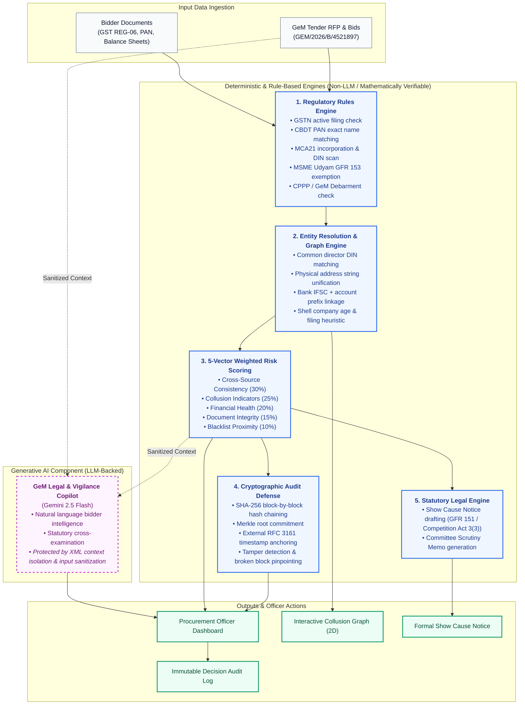

# 🛡️ AuthBid — GeM Compliance Intelligence

> **AI-Powered Integrated Bid Compliance Verification & Collusion Detection Platform for GeM Procurement**  
> *Smart India Hackathon (SIH26100)*

---

## 📖 Quick Links
- **[Full Project Functionalities & Architecture (FEATURES.md)](./FEATURES.md)**
- **Frontend URL:** [http://localhost:3000](http://localhost:3000)
- **Backend API:** [http://localhost:8000](http://localhost:8000)
- **Interactive API Docs (Swagger):** [http://localhost:8000/docs](http://localhost:8000/docs)

---

## ⚡ Quick Start (Local Run)

### 1. Start Backend
```powershell
cd backend
python -m uvicorn main:app --host 127.0.0.1 --port 8000 --reload
```

### 2. Start Frontend
```powershell
cd frontend
npm run dev
```

### 3. Or Run via Docker Compose
```bash
docker compose up -d
```

---

## 🏗️ System Architecture: Deterministic Rules vs. LLM Copilot



---

## 🌟 Core Technical Differentiators
* **Deterministic Rule Scrutiny**: Hard eligibility checks and risk scores are computed mathematically, NOT hallucinated by an LLM.
* **OSINT Graph Entity Resolution**: Detects cartel syndicates (Ring 1 & Ring 2) across shared directors, physical addresses, and banking channels.
* **Explainable 5-Component Risk Formula**: Full transparency into Consistency (30%), Collusion (25%), Financials (20%), Documents (15%), and Debarment (10%).
* **Cryptographic Tamper-Evident SHA-256 Audit Chain**: Complete mathematical ledger with external RFC 3161 Merkle anchoring.
* **Role-Based Access Control (RBAC)**: Distinct permissions for Officers, Committee Members, and System Admins.
* **Prompt-Injection Defense**: Strictly sanitizes and isolates bidder document text in Copilot prompts.
* **Document Vault with Inline Preview**: Checksum-verified certificate preview without mandatory downloads.
* **Decision Safeguards**: Mandatory justification modals and visible audit logs for disqualifications.

---

## 🎯 Canonical Demonstration Scenario
* **Tender Reference:** `GEM/2026/B/4521897` (Supply of 500 Desktop Computers with 3-Year On-Site Warranty)
* **Estimated Value:** ₹2,50,00,000 (₹2.50 Crore / 25,000,000 INR)
* **Master Source of Truth:** [`backend/mock_apis/synthetic_data.py`](./backend/mock_apis/synthetic_data.py)
* **12 Synthetic Bidders:**
  1. `B001` — **TechVision Solutions Pvt. Ltd.** (₹2,35,00,000) — *Collusion Ring 1 (Leader)*
  2. `B002` — **Reliable Computing Systems Ltd.** (₹2,42,00,000) — *Clean Compliant Bidder*
  3. `B003` — **DigiCore Infosystems Pvt. Ltd.** (₹2,48,00,000) — *Collusion Ring 1 (Accomplice)*
  4. `B004` — **GreenTech Peripherals** (₹2,28,00,000) — *Expired MSME Certificate*
  5. `B005` — **NexGen IT Solutions Pvt. Ltd.** (₹2,39,00,000) — *Collusion Ring 2 (Shared PNB Bank & Phone)*
  6. `B006` — **Bharat Electronics & Computing** (₹2,45,00,000) — *PAN Name Typo (97% fuzzy match — passes)*
  7. `B007` — **Quantum Digital Services Pvt. Ltd.** (₹2,20,00,000) — *Collusion Ring 1 (Shell Entity Cover Bid)*
  8. `B008` — **MegaByte Computers Pvt. Ltd.** (₹2,40,00,000) — *Historical Debarment (Cleared)*
  9. `B009` — **CloudFirst Technologies Pvt. Ltd.** (₹2,32,00,000) — *Collusion Ring 2 (Shared PNB Bank & Phone)*
  10. `B010` — **Pinnacle Systems India Pvt. Ltd.** (₹2,48,00,000) — *Clean Compliant Bidder*
  11. `B011` — **ByteWave Electronics Pvt. Ltd.** (₹2,30,00,000) — *GST Filing Gaps (2 Quarters)*
  12. `B012` — **Atlas Infosys Solutions Pvt. Ltd.** (₹2,46,00,000) — *Clean Compliant Bidder*

---

## 💻 Tech Stack & Architecture Notes
* **Frontend:** Next.js 16 (App Router, Turbopack), React 19, TypeScript, TailwindCSS v4, Lucide-React, Recharts, React-Force-Graph-2D.
  * Single-page dashboard architecture (`app/page.tsx`) with internal view state tabs: **Dashboard**, **Bidders Dossier**, **Graph Analysis**, **Compliance Checklist**, **Audit Chain**, and **Scrutiny Report**. (Not separate `/graph` or `/audit` URL routes).
  * No Next Auth, Zod, or Server Actions dependencies are used.
* **Authentication & RBAC:** Role selection via `X-User-Role` header (`officer`, `committee_member`, `admin`) allowing seamless role switching for hackathon evaluation; production OAuth2/SSO authentication roadmap is detailed in [FEATURES.md](./FEATURES.md).
* **Backend:** FastAPI (Python 3.12), Pydantic v2, Uvicorn, NetworkX.
* **AI Copilot:** Powered by Google Gemini 2.5 Flash via `langchain-google-genai` when `GEMINI_API_KEY` is configured, with seamless automatic fallback to canonical deterministic rule responses.
* **Cryptographic Ledger:** SHA-256 block-by-block hash chaining with live tamper detection simulation and RFC 3161 Merkle anchoring.

---

For comprehensive architectural details and regulatory roadmaps, please refer to [FEATURES.md](./FEATURES.md), [docs/REGULATORY_INTEGRATION_ROADMAP.md](./docs/REGULATORY_INTEGRATION_ROADMAP.md), and [docs/AUDIT_ANCHORING.md](./docs/AUDIT_ANCHORING.md).

