# AuthBid SIH26100 — Master Productionization Handoff Document

> **Platform Positioning:** AuthBid is an officer-supervised tender compliance and bidder risk assessment platform. It combines deterministic statutory and tender-rule validation, structured evidence provenance, cross-bidder relationship analysis, explainable risk scoring, and optional model-assisted evidence review. It does not make the final qualification decision; it prepares a traceable assessment for the Procurement Officer.

---

## 1. Architecture Diagram

```mermaid
graph TD
    subgraph Client ["Frontend Workspace (Next.js / TypeScript)"]
        UI_Tender["Tender Workspace"]
        UI_Pipeline["Verification Pipeline"]
        UI_Dossier["Bidder Evidence Dossier"]
        UI_Graph["Potential Relationship Analysis (Graph & Table)"]
        UI_Decision["Officer Decision & Audit Record"]
        UI_Report["Scrutiny Report & Memo"]
    end

    subgraph Gateway ["FastAPI Gateway & Security Layer"]
        AuthMiddleware["RBAC / Tenancy Guard"]
        Sanitizer["Prompt & Input Sanitizer (PII Redaction)"]
        DocIngest["Document Ingestion & Antivirus Validator"]
    end

    subgraph CoreEngine ["Deterministic Core Services"]
        PolicyEngine["Tender Policy Engine (Versioned Statutory Rules)"]
        RiskEngine["Explainable Risk Scorer (v2.1-sih26100)"]
        GraphEngine["Potential Relationship Analyzer (Sub-graph Isolation)"]
        AuditService["Append-Only Hash-Chain Commitment Service"]
        JobOrchestrator["Durable Verification Run Orchestrator"]
    end

    subgraph EvidencePipeline ["Secure Evidence Pipeline"]
        DocPipeline["Document Evidence Register (SHA-256 / OCR)"]
        ConnectorMgr["Registry Connector Manager (Circuit Breaker)"]
    end

    subgraph Connectors ["Registry Connectors (Protocol Normalized)"]
        GST_Conn["GSTN Connector (Synthetic Demo / Sandbox)"]
        PAN_Conn["PAN/NSDL Connector (Synthetic Demo / Sandbox)"]
        MCA_Conn["MCA21 Connector (Synthetic Demo / Sandbox)"]
        Udyam_Conn["MSME Udyam Connector (Synthetic Demo / Sandbox)"]
        CPPP_Conn["CPPP Debarment Connector (Synthetic Demo / Sandbox)"]
        Unavail_Conn["EPFO / ESIC / DigiLocker (Truthful Unavailable State)"]
    end

    subgraph AIGovernance ["Governed Model Assistance"]
        AI_Service["Evidence Review Service (Schema Guard)"]
        AI_Gemini["Gemini 2.5 Flash Provider (5s Timeout)"]
        AI_Fallback["Rule-Based Fallback Provider (Ground-Truth Evidence)"]
    end

    subgraph Persistence ["Durable Storage Layer"]
        PG_DB["PostgreSQL / SQLite (26 Domain Entities)"]
        DocStore["Private Document Vault (Cryptographic Hashing)"]
        AuditStore["Append-Only Audit Event Log"]
    end

    UI_Tender --> AuthMiddleware
    UI_Pipeline --> JobOrchestrator
    UI_Dossier --> DocPipeline
    UI_Graph --> GraphEngine
    UI_Decision --> AuditService
    UI_Report --> AuditService

    AuthMiddleware --> Gateway
    Gateway --> CoreEngine

    JobOrchestrator --> PolicyEngine
    JobOrchestrator --> RiskEngine
    JobOrchestrator --> GraphEngine

    PolicyEngine --> ConnectorMgr
    ConnectorMgr --> GST_Conn
    ConnectorMgr --> PAN_Conn
    ConnectorMgr --> MCA_Conn
    ConnectorMgr --> Udyam_Conn
    ConnectorMgr --> CPPP_Conn
    ConnectorMgr --> Unavail_Conn

    DocIngest --> DocPipeline
    DocPipeline --> DocStore

    PolicyEngine --> PG_DB
    RiskEngine --> PG_DB
    AuditService --> AuditStore

    AI_Service --> AI_Gemini
    AI_Service --> AI_Fallback
    UI_Dossier --> AI_Service
```



---

## 2. SIH26100 Requirement Traceability Matrix

| Requirement Area | SIH26100 Description | AuthBid Implementation | Verification Test / Evidence | Documented Limitations |
| :--- | :--- | :--- | :--- | :--- |
| **Tender Requirements** | Ingest tender clauses, financial thresholds, and statutory criteria | `backend/policy/engine.py` (`PolicyEvaluationEngine`), `backend/routers/tenders.py` | `test_policy_engine.py` | Policy criteria dynamically loaded from tender schema; custom clauses require policy version update |
| **Document Ingestion** | Secure upload, MIME/extension checks, malware scanning, cryptographic hashing | `backend/documents/service.py` (`DocumentPipelineService`) | `test_document_pipeline.py` (7 tests) | Max 15MB per document; ClamAV/cloud scanner interface simulated with EICAR detection |
| **Registry Retrieval** | Retrieve & normalize GST, PAN, MCA, MSME data with zero silent passes | `backend/connectors/` (`RegistryConnector` Protocol, CircuitBreakers, SHA-256 snapshots) | `test_connectors.py` (4 tests) | Live endpoints require API Setu credentials; marked as `synthetic_demo` when offline |
| **Statutory Validation** | Deterministic check of GST, PAN, turnover, experience, MII, OEM, debarment | `backend/policy/engine.py` (`EvaluationOutcome`: PASS, FAIL, WARNING, NOT_APPLICABLE, INDETERMINATE) | `test_policy_engine.py`, `test_pipeline_integration.py` | Evaluates strict statutory rules; models never override statutory outcomes |
| **Entity Matching** | Cross-source fuzzy name and identifier matching | `difflib.SequenceMatcher` (85% threshold) + exact PAN/GSTIN match | `test_pipeline_integration.py` | Legal name variations handled; complex corporate restructuring requires officer review |
| **Risk Assessment** | Explainable, versioned risk score (0-100) with separated eligibility status | `backend/routers/verification.py` (`_calculate_risk_score`, policy `v2.1-sih26100`) | `test_risk_scoring.py` (8 tests) | Component weights: Consistency (30%), Collusion (25%), Financial (20%), Doc Integrity (15%), Debarment (10%) |
| **Evidence Dossier** | Normalized unified view model with source citations, timestamps, and hashes | `backend/routers/verification.py`, `frontend/app/components/dossier/` | `test_api_contracts.py`, `DossierView.tsx` | Full document previews supported via SHA-256 verified inline preview cards |
| **Relationship Analysis** | Cross-bidder shared director, address, bank, phone, email detection | `backend/routers/graph.py` (`_build_cross_bidder_graph`, `table_view`, sub-graph filters) | `test_collusion_rules.py` (5 tests), `test_api_contracts.py` | Labeled strictly as **Potential Relationship Indicators**; collusion not legally concluded |
| **Model Assistance** | Governed explanation, facts extraction, draft queries | `backend/ai/service.py`, `EvidenceReviewService`, `PromptSanitizer` | `test_ai_governance.py` (2 tests) | Governed with 5s timeout, PII redaction, strict JSON schema, and `Rule-based fallback` |
| **Officer Decision** | Mandatory reason/justification for disqualification, role-based authorization | `backend/routers/verification.py` (`/decision`), `backend/models/auth.py` | `test_rbac_and_anchoring.py` (7 tests) | Only `Officer` and `Admin` roles may record final procurement decisions |
| **Audit Defense** | Append-only SHA-256 hash-chain commitment with independent CLI verifier | `backend/models/database.py`, `backend/scripts/verify_audit_chain.py` | `test_hash_chain.py` (3 tests), CLI execution | Independent CLI verifier runs without trusting the frontend UI |

---

## 3. Database Schema & Migration Summary

AuthBid implements a durable PostgreSQL domain model in [`backend/models/orm.py`](file:///c:/Users/ASUS/Downloads/sih%202/backend/models/orm.py) using SQLAlchemy 2.0 with automatic SQLite fallback for local developer/demo environments:

### Core Tables (26 Entities):
1. **Tenancy & IAM:** `organizations`, `users`, `roles`, `permissions`, `user_roles`.
2. **Tenders & Policy:** `tenders`, `tender_requirements`, `requirement_versions`.
3. **Bidders & Submissions:** `bidders`, `bid_submissions`.
4. **Document Register:** `documents`, `document_versions`, `document_extractions`.
5. **Connectors & Snapshots:** `registry_connectors`, `registry_requests`, `registry_response_snapshots`.
6. **Assessment Runs:** `verification_runs`, `bidder_assessments`, `compliance_check_results`, `evidence_items`, `anomaly_findings`.
7. **Relationships & Graph:** `relationship_edges`.
8. **Risk & AI Governance:** `risk_assessments`, `model_runs`, `recommendations`.
9. **Decision & Audit:** `officer_decisions`, `audit_events`, `anchor_commitments`.

---

## 4. Connector Inventory

| Connector Name | Source System | Protocol Implementation | Current Environment Status | Failover & Circuit Breaker |
| :--- | :--- | :--- | :--- | :--- |
| `gst_connector` | GSTN (Goods and Services Tax Network) | `GSTConnector` | `synthetic_demo` / `sandbox` | 5s timeout, 3 retries, exponential backoff, CircuitBreaker (3 failures) |
| `pan_connector` | CBDT / NSDL PAN Verification | `PANConnector` | `synthetic_demo` / `sandbox` | 5s timeout, 3 retries, exponential backoff, CircuitBreaker (3 failures) |
| `mca_connector` | MCA21 V3 Company & Director Registry | `MCAConnector` | `synthetic_demo` / `sandbox` | 5s timeout, 3 retries, exponential backoff, CircuitBreaker (3 failures) |
| `udyam_connector` | Ministry of MSME Udyam Portal | `UdyamConnector` | `synthetic_demo` / `sandbox` | 5s timeout, 3 retries, exponential backoff, CircuitBreaker (3 failures) |
| `blacklist_connector` | CPPP / GeM Debarment Database | `BlacklistConnector` | `synthetic_demo` / `sandbox` | 5s timeout, 3 retries, exponential backoff, CircuitBreaker (3 failures) |
| `epfo_connector` | Employees' Provident Fund Organisation | `UnavailableRegistryConnector` | `unavailable` | Honest status `unavailable`, error code `EPFO_GATEWAY_NOT_CONFIGURED` |
| `esic_connector` | Employees' State Insurance Corporation | `UnavailableRegistryConnector` | `unavailable` | Honest status `unavailable`, error code `ESIC_GATEWAY_NOT_CONFIGURED` |
| `digilocker_connector` | DigiLocker National Document Gateway | `UnavailableRegistryConnector` | `unavailable` | Requires explicit consent token; never creates fake "Digitally Verified" badge |
| `startup_india_connector` | DPIIT Startup India Recognition | `UnavailableRegistryConnector` | `unavailable` | Honest status `unavailable`, error code `STARTUP_INDIA_NOT_CONFIGURED` |

---

## 5. AI Capability & Model Governance Summary

1. **Deterministic vs. Generative Separation:**
   - Statutory compliance, eligibility determinations, and risk scores are **100% deterministic**.
   - Language models are used exclusively for:
     - Extraction assistance and document text parsing
     - Natural language synthesis of observed facts with evidence citations
     - Drafting officer clarification letters
2. **Prompt Injection & PII Sanitization (`PromptSanitizer`):**
   - Filters directives like `ignore all previous instructions`, `system prompt`, `<|im_start|>`.
   - Redacts 10-digit phone numbers and 9-18 digit bank account numbers before prompts reach external models.
3. **Structured Output Enforcement (`ModelReviewResponse`):**
   - Responses must strictly match the Pydantic schema: `summary`, `observed_facts` (with `evidence_ids` and `source`), `uncertainties`, `suggested_follow_up`, `officer_decision_required: true`, and `disclaimer`.
4. **Resilient Fallback (`RuleBasedFallbackProvider`):**
   - When Gemini 2.5 Flash is unavailable or times out (5-second threshold), the system automatically falls back to deterministic rule-grounded synthesis labeled transparently as `Rule-based fallback`.

---

## 6. Risk-Score Specification & Calibration

- **Policy Version:** `v2.1-sih26100`
- **Formula:**
  $$\text{Overall Score} = \min(100, W_{\text{consistency}} + W_{\text{collusion}} + W_{\text{financial}} + W_{\text{doc}} + W_{\text{blacklist}})$$
- **Component Weights:**
  - **Cross-Source Consistency (30%):** Statutory pass/fail across independent registries ($((100 \times N_{\text{fail}} + 40 \times N_{\text{warn}}) / N_{\text{total}}) \times 0.30$).
  - **Collusion Indicators (25%):** Shared directors, addresses, bank branches, contact details ($\min(25 \times N_{\text{anom}}, 100) \times 0.25$).
  - **Financial Health (20%):** Revenue stability, multi-year turnover, and minimum threshold compliance.
  - **Document Integrity (15%):** Filing gaps, shell company heuristics (e.g. <365 days age with zero filings).
  - **Debarment Proximity (10%):** Active or historical CPPP/GeM debarment records.
- **Risk Thresholds:**
  - **Low:** $0 \le \text{Score} < 20$
  - **Medium:** $20 \le \text{Score} < 45$
  - **High:** $45 \le \text{Score} < 70$
  - **Critical:** $\text{Score} \ge 70$
- **Eligibility Separation:** Separate from the numeric risk score, the system assigns one of:
  - `Eligible based on available evidence`
  - `Requires officer review`
  - `Potential non-compliance`
  - `Indeterminate — source unavailable`
  - `Disqualified by officer decision`

---

## 7. Security Threat Model

| Threat Scenario | Mitigation in AuthBid |
| :--- | :--- |
| **Prompt Injection via Bidder Documents** | `_sanitize_bidder_input` and `PromptSanitizer.sanitize_prompt` strip jailbreaks and format markers; prompts isolate bidder text in strict quotes. |
| **Malicious Document Uploads (Executables / Scripts)** | `DocumentPipelineService.validate_file_metadata` enforces magic byte signature checks, MIME whitelist, size caps (15MB), and EICAR / embedded script scanning. |
| **SSRF via Connector URLs** | Hard-coded connector registries; external URLs strictly governed by validated settings; no arbitrary user-provided callback URLs. |
| **Tampering with Audit Records** | SHA-256 hash-chained commitments; independent CLI verifier detects any retroactive block modification. |
| **Insecure Default Credentials in Production** | `config.py` enforces startup validation: in `ENVIRONMENT=production`, default passwords and placeholder secret keys abort process startup. |
| **PII / Financial Data Leakage** | `PromptSanitizer.redact_pii` scrubs phone numbers and bank account numbers prior to external LLM provider calls. |

---

## 8. Data-Retention & Privacy Summary

- **Sensitive Identifiers:** PAN, GSTIN, DIN, Bank IFSC, and Udyam IDs are stored in tenant-isolated PostgreSQL schemas.
- **Log Masking:** Logs mask intermediate PAN and account numbers (e.g., `AAB****34A`).
- **Retention Schedule:**
  - Document uploads: Retained for the duration of the tender scrutiny and audit retention period (GFR Rule 151).
  - Audit trails: Permanent append-only storage; cannot be truncated or deleted.
  - LLM Prompts & Responses: Ephemeral in-memory execution; only hash commitments and structured output are persisted in `model_runs`.

---

## 9. Audit Verification Procedure

To verify the cryptographic integrity of the audit trail independently:

```bash
# Verify against running backend
python backend/scripts/verify_audit_chain.py --url http://127.0.0.1:8000/api/verification/audit-trail

# Or verify against an exported audit JSON file
python backend/scripts/verify_audit_chain.py --file path/to/audit_trail.json
```

**Expected Output:**
```text
======================================================================
 AuthBid SIH26100 — Independent Audit Trail Verifier
======================================================================
[*] Fetching audit trail from endpoint: http://127.0.0.1:8000/api/verification/audit-trail
[*] Loaded 48 audit blocks. Verifying cryptographic chain...
----------------------------------------------------------------------
[PASSED] AUDIT TRAIL VERIFICATION: PASSED
   Total Blocks Verified : 48
   Latest Root Hash      : 80552ac97e58fa3ac5e03e343310b3315a9688442ad70c85a6f850157adab53a
   Status                : Cryptographic audit trail is fully verified and unbroken.
======================================================================
```

---

## 10. Test & CI Quality Gate Report

- **Backend Test Suite:** 55 tests passed in 14.05s (`pytest backend/tests -v`).
  - `test_ai_governance.py`: 2 passed
  - `test_api_contracts.py`: 5 passed
  - `test_collusion_rules.py`: 5 passed
  - `test_config_validation.py`: 4 passed
  - `test_connectors.py`: 4 passed
  - `test_document_pipeline.py`: 7 passed
  - `test_hash_chain.py`: 3 passed
  - `test_inconsistency_fixes.py`: 6 passed
  - `test_pipeline_integration.py`: 1 passed (12 synthetic bidders evaluated)
  - `test_policy_engine.py`: 3 passed
  - `test_rbac_and_anchoring.py`: 7 passed
  - `test_risk_scoring.py`: 8 passed
- **Frontend Quality Gate:**
  - TypeScript compilation (`npx tsc --noEmit`): **0 errors**.
  - Production build (`npm run build`): **Compiled successfully in 2.5s with Next.js Turbopack**.

---

## 11. Demo Walkthrough

1. **Step 1: Tender & Capability Intake**
   - Navigate to `http://localhost:3000`.
   - Observe the **Simulated Sandbox Mode** indicator and truthful capability badges.
2. **Step 2: Run Verification Pipeline**
   - Click **Run Multi-Source Verification**.
   - Watch the durable pipeline orchestrate checks across all 12 synthetic bidders with real-time per-bidder status.
3. **Step 3: Review Risk Triage & Evidence Dossier**
   - Clean Bidders (e.g. B002, B004): 0.0 risk score, eligible status.
   - High-Risk / Review Bidders:
     - **B001, B003, B007:** Shared director & address relationship cluster.
     - **B005, B009:** Shared bank branch & phone relationship cluster.
     - **B006:** Expired MSME certificate.
     - **B008:** Active debarment under CPPP.
     - **B010:** Potential corporate-structure anomaly (recent incorporation without filings).
     - **B011:** GST return filing gaps.
     - **B012:** Turnover discrepancy against GST return implied revenues.
4. **Step 4: Explore Potential Relationship Network**
   - View the graph canvas or switch to the accessible **Relationship Table** fallback.
   - Filter by specific bidder or cluster for focused investigation.
5. **Step 5: Record Officer Decision & Generate Scrutiny Report**
   - Select a flagged bidder (e.g., B001).
   - Enter mandatory justification under GFR Rule 151 and record determination.
   - Generate official **Scrutiny Memo** with cryptographic audit proof.
6. **Step 6: Verify Audit Trail**
   - Run `python backend/scripts/verify_audit_chain.py` to confirm the audit hash-chain is unbroken.

---

## 12. Known Limitations

1. **Live Government Registry Credentials:** Production integration requires production API Setu, GSTN GSP, and MCA21 V3 client credentials. In the demo/sandbox environment, synthetic adapters simulate realistic schema responses.
2. **DigiLocker Consent Gateway:** DigiLocker document pull requires an active citizen Aadhaar OTP consent flow, which cannot be automated without live user interaction. It is honestly labeled as `unavailable`.
3. **External RFC 3161 Timestamp Authority:** External timestamp anchoring is currently recorded as a `Local Hash-Chain Commitment` with SHA-256 Merkle root. Production deployment requires binding to an accredited Trust Service Provider (TSP).

---

## 13. Deployment Runbook

### Prerequisites:
- Python 3.12+
- Node.js 18+
- Docker & Docker Compose (optional for containerized setup)

### Local / Staging Startup:
```bash
# 1. Backend setup
cd backend
pip install -r requirements.txt
uvicorn main:app --host 127.0.0.1 --port 8000 --reload

# 2. Frontend setup
cd frontend
npm install
npm run dev
```

### Production Docker Startup:
```bash
# Set mandatory environment variables
export POSTGRES_PASSWORD=$(openssl rand -hex 16)
export SECRET_KEY=$(openssl rand -hex 32)
export NEO4J_PASSWORD=$(openssl rand -hex 16)
export ENVIRONMENT=production

docker compose -f docker-compose.prod.yml up --build -d
```

---

## 14. Rollback & Disaster Recovery Runbook

1. **Database Rollback:**
   - PostgreSQL backups are created via `pg_dump`:
     ```bash
     pg_dump -U postgres -d authbid > backup_$(date +%Y%m%d_%H%M%S).sql
     ```
   - To restore:
     ```bash
     psql -U postgres -d authbid < backup_YYYYMMDD_HHMMSS.sql
     ```
2. **Audit Hash-Chain Integrity Recovery:**
   - If an unauthorized alteration is detected in the audit chain, administrators can invoke:
     ```bash
     curl -X POST http://127.0.0.1:8000/api/verification/restore \
          -H "Content-Type: application/json" \
          -H "X-User-Role: admin"
     ```
3. **Application Version Rollback:**
   - Containerized deployment can roll back to the previous stable tag:
     ```bash
     docker compose -f docker-compose.prod.yml down
     docker compose -f docker-compose.prod.yml pull backend:v1.0.0-stable
     docker compose -f docker-compose.prod.yml up -d
     ```

---

## 15. List of Changed Files & Architectural Reasons

| File Path | Changes Made | Architectural Reason |
| :--- | :--- | :--- |
| `backend/config.py` | Added `DEMO_MODE: bool = True`, `CAPABILITY_MATRIX`, and production credential security checks | Truthful platform positioning, environment separation, and prevention of default credentials in production |
| `backend/main.py` | Added `GET /api/capabilities`, removed deprecated `@router.on_event` | Expose capability matrix to frontend; eliminate FastAPI deprecation warnings |
| `backend/models/orm.py` | Created 26 production SQLAlchemy 2.0 entities | Establish durable PostgreSQL domain model replacing module globals |
| `backend/db/session.py` | Engine initialization with SQLite fallback | Database session management with support for both PostgreSQL and local development |
| `backend/policy/models.py` | Defined `PolicyRequirement`, `EvaluationResult`, `EvaluationOutcome` | Move statutory criteria out of hard-coded branches into typed, versioned models |
| `backend/policy/engine.py` | Deterministic compliance engine covering 12 statutory checks | Enforce zero silent passes and strict policy validation |
| `backend/connectors/base.py` | Defined `RegistryConnector` Protocol, `ConnectorResult`, and `CircuitBreaker` | Standardize registry integration boundary with retry, circuit breaker, and SHA-256 snapshot hashing |
| `backend/connectors/*.py` | Implemented GST, PAN, MCA, Udyam, Debarment, and truthful Unavailable connectors | Contract-tested connectors with honest status reporting |
| `backend/documents/service.py` | Ingestion validation, malware scanning, SHA-256 hashing, structured extraction | Secure document evidence pipeline (Phase 4) |
| `backend/ai/governance.py` | `ModelReviewResponse` schema, `PromptSanitizer` with PII redaction | AI governance, prompt injection defense, and structured output validation |
| `backend/ai/service.py` | Coordinated AI execution with Gemini 2.5 Flash and rule fallback | Governed model assistance with 5s timeout and deterministic ground-truth fallback |
| `backend/routers/graph.py` | Added `relationship_table`, sub-graph filtering, and professional terminology | Precise relationship indicators with accessible table fallback (Phase 7) |
| `backend/routers/verification.py` | Integrated durable runs, explainable risk score (v2.1), document endpoints, and truthful labels | Complete Phase 6, 8, 10, and 12 requirements |
| `backend/scripts/verify_audit_chain.py` | Independent CLI audit verifier script | Enable external reviewers to verify cryptographic hash-chain integrity independently |
| `backend/tests/` | 11 comprehensive test modules (55 tests passing) | Complete CI test coverage across all domain capabilities |
